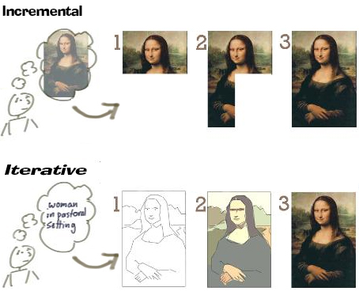
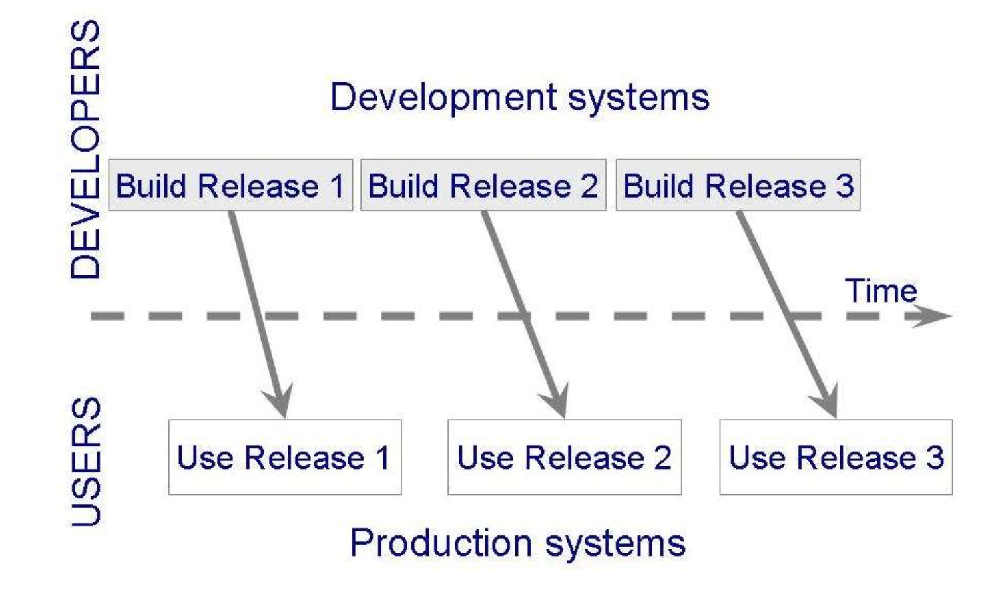
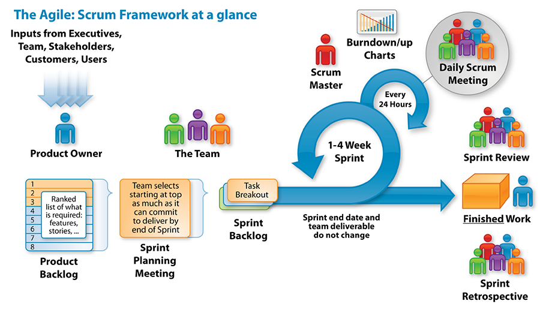

# software development process models

**contents**

0.  [why software engineering](#why-software-engineering)
1.  [a development process](#a-development-process)
2.  [software development process](#software-development-process)
3.  [activities](#activities)
4.  [activities may be divided](#activities-may-be-divided)
5.  [software development models](#software-development-models)
6.  [planned, disciplined models](#planned-disciplined-models)
7.  [incremental and iterative models](#incremental-and-iterative-models)
8.  [incremental vs iterative analogy](#incremental-vs-iterative-analogy)
9.  [phased development increments](#phased-development-increments)
10. [agile models](#agile-models)
11. [scrum software development](#scrum-software-development)
12. [scrum development methodology](#scrum-development-methodology)
13. [scrum roles](#scrum-roles)
14. [developing your cool new app](#developing-your-cool-new-app)
15. [release planning](#release-planning)
16. [how to estimate](#how-to-estimate)
17. [sprints](#sprints)
18. [sprint goal](#sprint-goal)
19. [burndown chart](#burndown-chart)
20. [daily scrum](#daily-scrum)
21. [sprint retrospective meeting](#sprint-retrospective-meeting)
22. [summary](#summary)

## why software engineering

-  software is vital to the us global competitiveness, innovation, and national security
-  also, the us economy, it infrastructure, healthcare, and education depend on software
-  great research opportunities
-  great professional opportunities
    -  be a part of the excitement
    -  fun to develop new products
    -  focus and the recommendations of the course

## a development process

-  a process is a set of activities that are planned and are performed to achieve a given purpose, and includes,
    -  roles and responsibilities
    -  tools
    -  procedures and methods that define how to do the tasks and relationship between the tasks
-  why a process
    -  provides guidelines and a structure
    -  provides for consistency
    -  minimizes redundanies
    -  provides output to be as systematic as possible

## software development process

-  when a process involves building a software, the process may be referred to as the software development process
-  four major activities (very broad)
    -  requirements engineering
    -  design
    -  coding / implementation
    -  testing

## activities

-  requirements engineering
    -  requirements analysis
    -  system requirements
    -  what are the requirements of a given software

## activities may be divided

-  software development activities may be presented as a set of activities
-  requirements engineering
    -  requirements elicitation
    -  requirements analysis
    -  requirements modeling
    -  requirements validation

-  software development activities may be presented as a set of activities 
-  design
    -  architectural design
    -  data structure design
    -  component design
    -  interface design

## software development models

-  describe the ordering of development activities and the expected artifacts (outcomes) from each activity

-  many development models
    -  planned, disciplined ("linear") models (e.g. the waterfall model)
    -  prototyping model
    -  phased or incremental models (e.g. the unified process models)
    -  spiral model
    -  agile models (e.g. scrum model)

## planned, disciplined models

-  waterfall model (and its variations)
-  one of the first process development models proposed
-  works for well understood problems with minimal or no changes in the requirements
-  each major phase is marked by milestones and devliveravles (artifacts)
-  long wait before a final product

```
  requirements engineering
  ↓
  design
  ↓
  development
  ↓
  testing
  ↓
  deployment
  ↓
  maintenance
```

## incremental and iterative models

-  also known as phased models
-  incremental development:  starts with small functionality, and adds new functionality with each new release
-  iterative development:  starts with full system (but very minimal detail), then enhances the functionality of each software component with each new iteration



## phased development:  increments



## agile models

-  iterative and incremental
-  several well-known agile models -- scrum



## scrum software development

-  scrum is a framework for developing, delivering, and sustaining complex products

## scrum development methodology

-  one of the most popular agile software development methodologies
    -  other ones?
-  important scrum concepts
    -  team roles
    -  product backlog
    -  sprints
    -  burndown charts
    -  estimation techniques
    -  sprint retrospectives

## scrum roles

-  product owner
    -  makes sure the right features get into a new release (representing the users, customers)
    -  set direction
-  scrum master (project manager)
    -  ensures the project progresses smoothly
    -  team members have the tools to get their job done
    -  sets up meetings, monitors, plans releases
-  developers, testers, customers, ...

## developing your cool new app

-  you will get feature requests from a variety of stakeholders
-  features are always from the perspective of the end users
-  known as user stories:  "as a user (role) i want 2F authentication"
-  the role could be a customer, an end user, and executive, ...
-  backlog:  a collection of user stories (or wish lists)

## release planning

-  start with the user stories and create a release backlog
-  prioritize and estimate time for each
-  larger one may be broken down

## how to estimate

-  story points
-  or in terms of hours, days, weeks, months, ...

## sprints

-  start with the release backlog
-  may need several sprints to get the work done
    -  sprints:  short duration milestones
    -  2 - 30 days (depending on release cycles)


