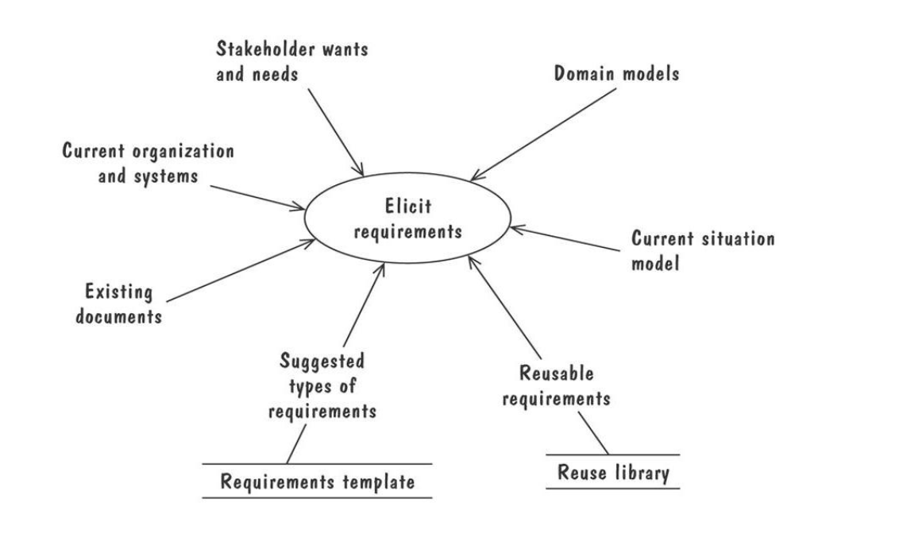
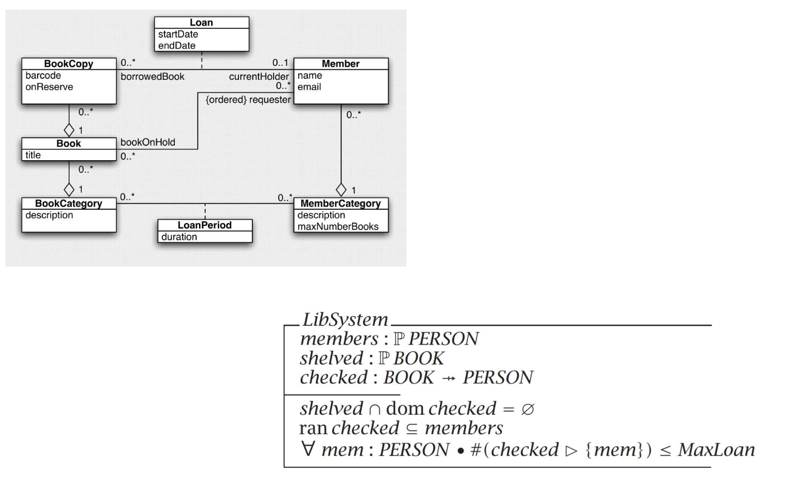

# requirements engineering

**contents**

1.  [requirements engineering](#requirements-engineering)
2.  [what is a requirement](#what-is-a-requirement)
3.  [where do requirements come from](#where-do-requirements-come-from)
4.  [common re activities](#common-re-activities)
5.  [domain engineering](#domain-engineering)
6.  [why domain engineering](#why-domain-engineering)
7.  [examples of domains](#examples-of-domains)
8.  [examples of a specific domain](#examples-of-a-specific-domain)

## requirements engineering

-  a set that of activities that identify, document, and communciate the purpose of a new software
-  a process that acts a bridge between the real world needs of users and the capabilities afforded by the software
-  the process of establishing the _functionalities_ (services) expected from a new software and teh _constraints_ under which it operates and is developed
-  two important questions
    -  why a new system based on current or foreseen conditions
    -   what system features (services, functionalities) it will provide

##  what is a requirement

-  a requirement is an expression of desired behavior
-  it may range form a high-level abstract statement of a service or of a system constraint to be detailed mathematical functional specification
-  requirements are a specification of what should be implemented; they are descriptions of how the system should behave
    -  not how the software should be designed

## where do requirements come from

## common re activities

-  domain engineering
-  requirements elicitatiojn
    -  many different techniques
-  requirements documentation
    -  many different forms and notations
-  requirements validation

## domain engineering

-  before software is developed, we must understadn the requirements
-  before requirements can be finalized, we must understand the domain
-  what do we mean by a domain?
    -  an area of natural or human activity
    -  healthcare, railways, banking, aerospace, chemical engineering, fintech
-  other terms
    -  domain analysis, domain understanding, domain modeling

## why domain engineering

-  it is knowledge acquisition
-  th eobjective is to learn
    -  about the origanization, its structure, business needs, culture, roles, responsibilities, stakeholders
-  about the domain:  concpets, terminologies, regulations

-  better prep/understanding current and future apps that share a set of common characteristics
-  good understanding of a domain is key to identifying and devloping reusable software components
    -  establish a product line
    -  a software product line is a set of software systems sharing a common managed set of features that satisfy the specific needs of a particular domain and are developed form a common set of core assets

##  examples of domains

-  financial industry:  banking, insurance, securities,...
-  healthcare:  hospitals, clinics, patienst, doctor offices,...
-  transportation:  road, railway, sear airways,...
-  oil and gas systems:  pumps, pipes, valves, refineries, distribution
-  ...
-  railway:  tracks, lines, platforms, switch, corssover, siding, stations, rails
-  rail:  length, topology, context (in a tunnel, along a platform,...)
-  an understanding of all important concepts is most essential
-  can be presented informally and formally

##  informal description of railway nets

##  formal description of railway nets

##  visual description of railway nets

##  sketching a domain model

##  summary

-  the domain model captures the concepts in the domain of the problem, and the relationships between them
-  it establishes the vocabulary of the problem

##  requirements elicitation

-  objective:  to identify the key stakeholder, and to communicate and collaborate with them to identify and document a software product features
-  artifact-driven:  rely on the specific types of artificats (documents) to obtain knowledge
-  stakholder-driven:  rely on specific types of interaction with stakeholders to obtain knowledge

##  artifact-driven

-  rely on the specific types of artifacts to obtain knowledge
    -  background study
    -  data collection, survey questionnaires
    -  reports
    -  scenarios, storyboards for problem world exploration
    -  prototyes, mock-ups for early feedback
    -  knowledge reuse for domain-specific software

##  stakeholder-driven

-  rely on specific types of interaction with stakholder

##  types of requirements

##  non-functional requirements

##  requirements documentations

##  exaples of modeling requirements

##  requirements validation

-  objective:  QA quality assurance
-  the specifications should be _verified_ against each other in order to find inconsistencies and omissions
-  the specifications should be _validated_ with stakholder in order to pinpoint inadequacies with respect to actual needs

##  summary:  characteristics of good requirements

-  completeness:  the requirements, assumptions, and domain properties must be sufficient to ensure that the new system will satisfy its expected objectives
-  consistency:  must be compatible with each other
-  unambiguity:  the requirements, assumptions, and domain properties must be formulated in way that precludes different interpretations
-  good structuring:  organized in a way that highlights the structural links among its elements
-  modifiability:  should be possible to revise, adapt, extend, or contract the requirements document through modifications that are as local as possible
-  traceability:  the context in which an item of the rd was created, modified, or used should be easy to retrieve
-  pertinence:  the requirements and assumptions must all contribute to the satisfaction of one or several objectives underpinning the system to be
-  feasibility:  requirements must be realizable in view of the budget, schedule, and technology constraints
-  comprehensbility:  formulation of requirements, assumptions, and domain properties must be comprehensible by the people who need to use them

