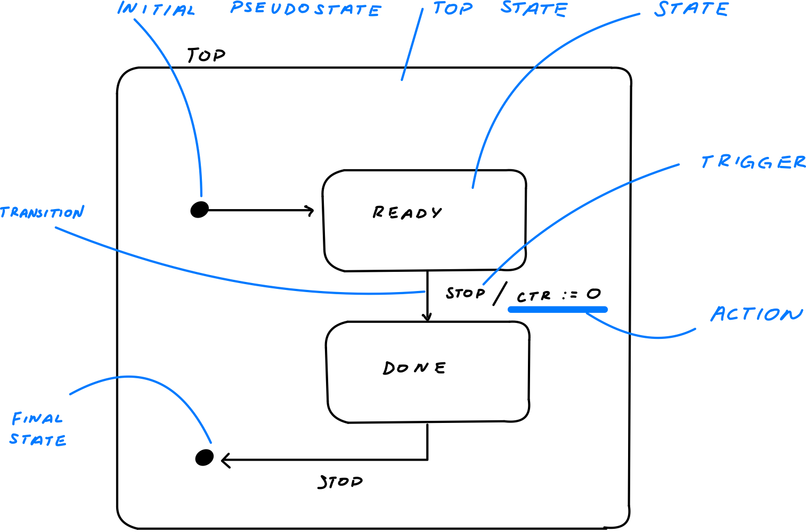

# behavioral modeling with uml state diagrams

**content**

1.  [state machines background](#state-machines-background)
2.  [terminology](#terminology)
3.  [common state machine diagram](#common-state-machine-diagram)

## state machines background

-  automata is a machine whose output behavior is not only a direct consequence of the current input, but of some past history of its inputs
-  the internal state represents the past experience
-  useful for describing events driven (concrete) behavior

## terminology

1.  state
-  all objects have a state
-  statespace for an object
-  state of stack

2.  state transition modeling:  modeling the states of an object
-  state modeling or modeling the state
-  statechart modeling
-  finite state modeling
-  state machines

  

##  common state machine diagram

  

note on why we have systems requirement engineering:  ensure that this [ariane 5 rocket launch explosion](https://www.youtube.com/watch?v=PK_yguLapgA) was the cause of this was the parameters on a function was not indicated, word size was the cause

##  another example with more states

  

##  state transition can generate output

##  another example

##  the state can have variables

## a variety of states can be modeled

-  a digital watch, microwave system, an engine, cruise control, an atm machine
-  a software module that does lexical analysis
-  normally used for objects with complex behaviors
-  but ok to use for simpler concepts (a library)

##  an informal definition of a state machine

-  a set of input symbols
-  a set of output signals
-  a set of states
-  a set of transitions triggering signal
-  a set of transitions action
-  a set of extended state variables
-  an initial state designation
-  a set of final states (if terminating automaton)

## umls simplified statechart notation

  

