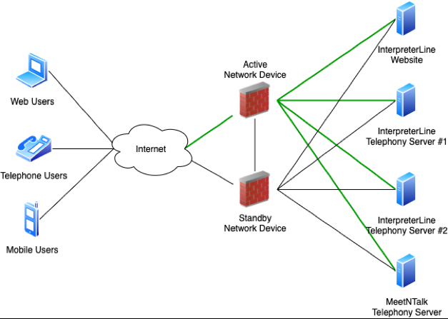
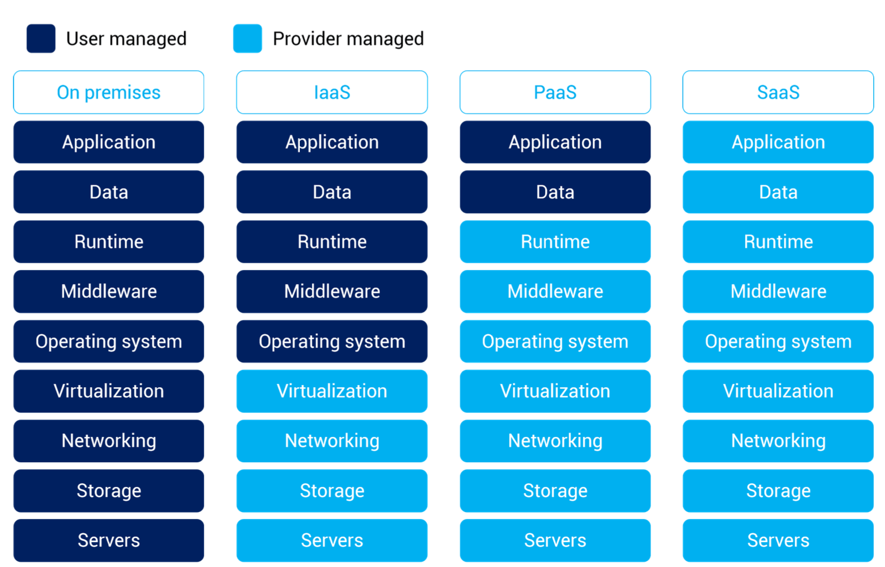
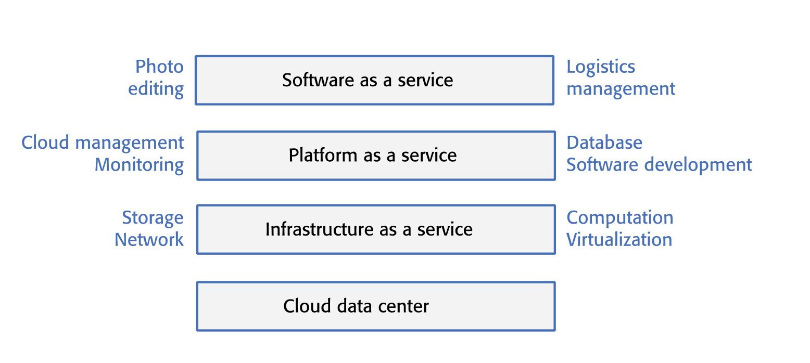

#  cloud based software

**cloud comes from taking an object whos details are irrelevant from object oriented design**

###  contents

1.  [cloud computing](#cloud-computing)

##  cloud computing

-  on demand availability and delivery of computing services
    -  servers
    -  storage
    -  databases
    -  networking
    -  software
    -  analytics

##  cloud based software

-  the cloud is a very large number of remote servers that are offered for rent by companies that own these servers
    -  you can rent as many servers as you need, run your software on these servers, and make them available to your customers
    -  your customers can access these servers from their own computers or other networked devices
    -  you may rent a server and install your own software
    -  you may pay for access to software products that are available on the cloud

##  remote servers

-  remote servers are virtual (implemented in software, not hardware)
-  many virtual servers can run simultaneously on each cloud hardware node
-  very powerful hardware to run multiple virtual servers
    -  performance not affected

-  cloud management software makes it easy to acquire and release servers on demand
-  if you need resources for only a short time, you simply pay for the time that you need
-  this means that software that runs on the cloud can be scalable, elastic, and resilient

##  scailability

-  scalability reflects the ability of your software to cope with increasing numbers of users
-  as the load on your software increases, your software automatically adapts so that the system performance and response time are maintained

##  elasticity 

-  elasticity is related to scalability but also allows for scaling down as well as scaling up
-  that is, you can monitor the demand on your application and add or remove servers dynamically as the number of users changes

##  elasticity vs scalability

-  scalability handles the changing needs of an application
    -  statically adding or removing resources to meet application demands if needed
    -  provisioning new servers to meet static demand growth

-  elasticity to match the resources allocated with the actual number of resources needed at any given point in time 
    -  scalability of the resources (cpu, memory)

##   resilience

-  resilience means that you can design you rsoftware architecture to tolerate server failures
    -  you can make several copies of your software concurrently available
    -  if one of these fails, the others continue to provide a service

##  why cloud computing?

-  cost:  you avoid the initial capital costs of hardware procurement
-  startup time:  you dont have to wait for hardware to be delivered before you can start work; using the cloud, you can have servers up and running in a few minutes.
-  server choice:  if you find that the servers you are renting are not powerful enough, you can upgrade to more powerful systems
    -  you can add servers for short-term requirements, such as load testing
-  distributed development:  if you have a distributed development team, working from different locations, all team members have the same development enviroment and can seamlessly share all information

##  virtual cloud servers

-  a virtual server runs on an underlying physical computer and is made up of an operating system plus a set of software packages that provide the server functionality required
-  a virtual server is a stand-alone system that can run on any hardware in the cloud
-  virtual machines, running on a physical server hardware, can be used to implement virtual servers
    -  hypervisor provides hardware emulation that stimulates the operations of the underlying hardware
-  if you use a virtual machine to implement virtual servers, you have exactly the same hardware platform as a physical server

##  implementing a virtual server as a vm

##  what is a hypervisor

##  hypervisor type 1 and type 2

##  implementing a virtual server as a vm

##  implementing a virtual server as a vm

....

##  various things as a service

-  on premises
-  iaas - infrastructure as a service
-  paas - platform as a service
-  saas - software as a service

##  software as a service

-  increasingly, software products are being delivered as a service, rather than installed on the buyer's computers
-  if you deliver your software product as a service, you run the software on your servers, which you may rent form a cloud provider
    -  for example [salesforce](https://www.salesforce.com/products/what-is-salesforce/?d=70130000000i7zF)
-  customers dont have to install software and they access the remote system through a web browser or dedicated mobile app
-  the payment model for software as a service is usualy a subscription model.
    -  users pay a monthly fee to use the software rather than buy it outright

##  benefits of saas for sotware products

-  cash flow
-  update managerment
-  continuous deployment
-  payment flexibility
-  try before you buy
-  data collection

##  advantages and disadvantages of saas for customers

-  advantages:  
    -  mobile, laptop, and desktop access
    -  no upfront costs for software or servers
    -  immediate software updates
    -  reduced software management costs
-  disadvantages
    -  privacy regulation conformance
    -  network constraints and security concerns
    -  lost of control over updates
    -  service look in and data exchange

##  data storage and management issues for saas

-  regulation
-  data transfer
-  data security
-  data exchange
    -  if you need to exchange data between a cloud service and other services or local software applications, this can be difficult unless the cloud service provides an api that is accessible for external use

##  cloud platforms

-  cloud platforms include general purpose clouds such as AWS or lesser known platforms orietnted around a specific applications, such as the sap cloud platform
-  there is no "best" platform and you should choose a cloud provider based on your background and experience

##  technical issues in cloud platform choice

-  cloud platform has choices to maintain - expected load and load predictability, resilience, supported cloud services, privacy and data protection

##  saas design issues

-  local/remote processing
-  authentication
-  information leakage
-  multi-tenant and multi-instance systems

##  key points

-  the cloud is made up for a number of virtual servers that can you rent for your own use
    -  remote access; pay for what you need
-  virtualization is a technology that allows multiple servers instance to be run on teh same physical computer
-  virtual machine are physical server replicas on which you run your own operating system, technology stack and applications
-  containers are a lightweight virtualization technology that allows rapid replication and deployment of virtual servers
-  a fundamental feature of the cloud is that "everything" can be delivered as a service and accessed over a internet

##  cloud terminology

-  scalability, elasticity, resilience
-  **i**nfrasture **a**s **a** **s**ervice, **p**latform **a**s **a** **s**ervice, **s**oftware **a**s **a** **s**ervice

