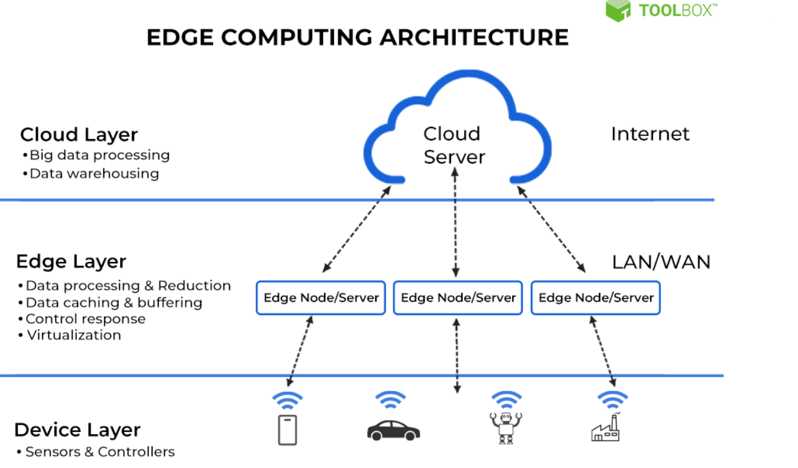

#  microservices

##  cloud computing

-  on demand availability and delivery of computing services
    -  servers
    -  storage
    -  databases
    -  networking
    -  software
    -  analytics

##  cloud computing related concepts

-  on premise computing
    -  local servers, routers, printers,...
-  edge computing
-  fog computing

##  edge computing

-  related concepts:  edge computing



##  what is edge computing

-  edge is about processing data closer to where it's being generated, enabling processig at greater speeds and volumes

##  what is edge computing

-  edge is about processing data closer to where it's being generated, enabling processing at greater speeds and volumes, leading to greater action led results in real time
-  collect and process data, share timely insights and if applicable, take appropriate action
    -  examples:
    -  weable on your wrist to the computers parsing intersection traffic flow
    -  iot devices
    -  smart utility grid analysis

##  edge computing anopther view

-  edge computing is transforming how data generated by billions of IoT and other devices is stored, processed, analyzed, and transported
    -  before/instead of moving to the cloud
    -  running fewer processes in the cloud
-  the practice of moving computing power physically closer to where data is generated, usually an IoT device or sensor
-  internet of medical thinsg (iomt)
    -  monitor glucose levels, blood pressure levels

##  fog computing benefits

-  a compute layer between the edge and cloud
-  receives data from the edge before it reaches the cloud
-  benefits
    -  enables low-latency networking connections between devices
    -  minimizes bandwidth requirements compared to if that data had to be transferred back to a data center or cloud for analysis

##  intro to microservices

-  microservices is the evolution of service oriented architecture
-  what is service oriented architecture?
    -  an architectural style that focuses on discrete services instead of a monolithic design
    -  each service is an soa embodies the code and data required execute a complete
    -  example:  checking a customer's credit

##  software services 

-  a software service is a software component that can be accessed from remote computers over the Internet
    -  given an input, a service produces a corresponding output, without side effects
    -  the service is accessed through its published interface and all details of the service implementation are hidden
    -  services do not maintain any internal state
    -  state information is either stored in a database of is maintained by the service requestor

##  software services

-  services do not maintain any internal state
-  when a service request is made, the state informationmay be included as part of the request, and the updated state information is returned as part of the service result
-  as there is no local state, services can be dynamically reallocated from one virtual server to another and replicated across several servers

##  related terminology

-  soap - simple object access protocol
-  xml - a way for providing data
-  json
-  wsdl
-  restful services
-  api
-  api gateway

-  web services were initially thought of as implementations of traditional software components that could be distributed over a network
-  soap (simple object access protocol)
    -  a message protocol that enables the distributed elements of an application to communicate

##  xml

-  xml (eXtensible markup language)
    -  a markup language like html
    -  used for structuring arbitrary data

```xml
<SampleXML>
    <Colors>
        <Color1>White</Color1>
        <Color2>Blue</Color1>
        <Color3>Black</Color1>
        <Color4>Special="Light">Green</Color4>
    </Colors>
    <Fruits>
        <Fruits1>Apple</Fruits1>
        <Fruits1>Apple</Fruits1>
    </Fruits>
</SampleXML>
```


