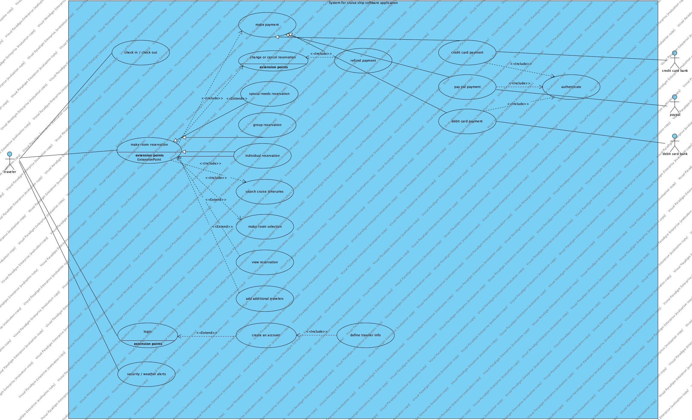

# lab05 uml use case modeling

**contents**

1.  [objective](#objective)
2.  [what to turn in](#what-to-turn-in)
3.  [assessment](#assessment)
4.  [problem description](#problem-description)
5.  [visual paradigm online](#visual-paradigm-online)
6.  [make payment description](#make-payment-description)
7.  [final product](#final-product)

## objective

understand the use case modeling and its structuring features

## what to turn in

a pdf file that includes the use case diagram but also the description (an outline) of the "make payment" use case

## assessment

-  **25 points** the use case model with potential actors and use cases
-  **10 points** appropriate use of the structuring options of uml use case diagram (e.g. include, extend, and generalization/specialization)
-  **5 points** a short outline description of the "make payment" use case
-  **full credit** [visual paradigm](https://www.visual-paradigm.com/download/?platform=macosx&arch=aarch64)

## problem description

**model the description via the uml case diagram**  the model must include appropriate use case structuing features.

consider a cruise ship traveling software application.  your objective is to describe the requirements for purchasing a cruise ticket via a uml use case diagram.  you interview a staff of the cruise compay, and they describe their expectations as follows (normally the interview conversations are not as descriptive as what follows):  

the cruise line requires a traveler 

1.  **create an account** with their information so their information is in the system and they can log in at a later time
2.  to **make a cruise ship room reservation** a traveler will need the very common funcationalities like
3.  **searching for cruise itineraries**
4.  **make a reservation**
5.  **make a payment**
6.  **make a room selection**
7.  **view the reservation at a later time**
8.  **makes changes or cancel a reservation**

often a cruise line requires that a reservation includes two or more travelers.  therefore the process should include an option for adding additional travelers, a traveler has multiple options for making a payment; these include...

1.  **payment via credit card**
2.  **payment via paypal account**
3.  **direct deposit from bank account**

all of these methods request **authentication**

if the reservation is canceled the payment maybe in full maybe in partial will be refunded to the traveler.  the traveler making a reservation could be an individual, group or person with special needs.  at some point before the cruise ship embakation, a trabveler will need to check in. as part of the reservation process, the cruise line reservatiopn often provides a traveler to check for any weather or security warnings of the destination.

### make payment description

The "Make Payment" use case allows a traveler to select a payment method and authenticate the payment for a cruise room reservation. The traveler can choose to pay via a credit card, a PayPal account, or direct deposit from a bank account. The use case also handles the refund of the payment in case of a cancellation. The authentication process ensures secure payment and prevents fraudulent transactions.

### final product

