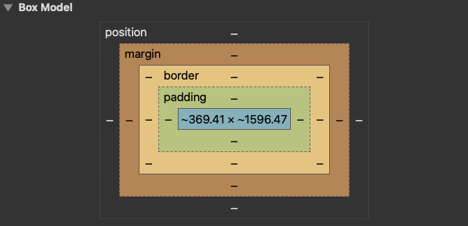

#  web programming in html, css, js, php

###  contents

1.  [what is html](#what-is-html)
2.  [exanple of html](#example-of-html)
3.  [insert images](#insert-images)
4.  [insert videos](#insert-videos)
5.  [links](#links)
6.  [what is javascript](#what-is-javascript)
7.  [linking to a javascript file: script](#linking-to-a-javascript-file--script)
8.  [even-driven programming](#event-driven-programming)
9.  [get user input](#get-user-input)
10. [what is css](#what-is-css)
11. [css syntax](#css-syntax)
12. [why css](#why-css)
13. [three css definition locations](#three-css-definition-locations)
14. [css syntax:  selectors](#css-syntax-selectors)
15. [php](#php)
16. [php files](#php-files)
17. [why php](#why-php)
18. [basic syntax](#basic-syntax)
19. [php variables](#php-variables)
20. [for loop](#for-loop)
21. [in the future](#in-the-future)

## what is html

-  html hyper text markup language is a language used to build web pages
-  using html you can build a web page with text, graphics, sounds, and video
-  the essence of html programming is tags
    -  a tag is a keyword encloded by angle brackets
    -  there are opening and closing tags
    -  the affected text is between the two tags
    -  tag commands can be in lower or uppercase
    -  tags can be nested

## example of html

```html
<html>
<head>
    <h1>eecs 248 lab server</h1>
</head>
<body>
hello everyone, this is the index of lab 07

please follow these links to visit other practies.  try it beautiful.

</body>
<br>
    <a href="practice1.html">practice 1</a>
    <a href="practice2.html">practice 2</a>
    <a href="practice3.html">practice 3</a>
    <a href="practice4.html">practice 4</a>
</html>
```

## insert images

-  `img src="image.png">` where image.png indicates the location of the image file, it could be a local pciture or a website picture url
-  the `WIDTH=n` and `HEIGHT=n` attributes can be used to adjust the size of an image
-  the attribute `BORDER=n` can be used to add a border `n` pixels thick around the image

## insert videos

the following code blocks create an inline frame that embeds a youtube video player, sets its dimensions and attributes, and specifies which browser features are allowed to be used by the player.

**flat**
```html
<iframe width="560" height="315" src="https://www.youtube.com/embed/hNgh-WoN6p4" title="YouTube video player" frameborder="0" allow="accelerometer; autoplay; clipboard-write; encrypted-media; gyroscope; picture-in-picture; web-share" allowfullscreen></iframe>
```

**stacked**
```html
<iframe width="560" height="315" 
        src="https://www.youtube.com/embed/hNgh-WoN6p4" 
        title="YouTube video player" 
        frameborder="0" 
        allow="accelerometer; autoplay; clipboard-write; encrypted-media; gyroscope; picture-in-picture; web-share" 
        allowfullscreen>
</iframe>
```

-  this code creates a video player onto a webpage using the `iframe` element 
-  the `iframe` element defines an inline frame that is used to embed another document within the current `HTML` document.  in this case the `src` sttribute specifies the url of the youtube video to be embedded, and the `width` and `height` attributes specify the dimensions of the video player
-  `title` attributes provides a text description of the video which can be useful for accessibility purposes. 
-  `frameborder` attribute specifies whether or not the iframe should have a border around it (in this case it is set to 0 to remove the border
-  `allow` attribute is used to specify which browser features are allowed to be used by the embedded content.  in this case the videp player is allowed to use features like the accelerometer, autoplay, encyrpted media, and gyroscope, among others
-  `allowfullscreen` attribute is used to allow the video player to be viewed in full screen mode

## links

-  links let you move from one page to another, play movies and sound, send emails, download files, and more...
-  a link has three parts, a **destination**, a **label**, and a **target**
-  to create a link type `<a href="page.html">label</a>`
-  the label is the text that will appear underlined or highlighted on the page

###  `<a href="page.html">label</a>`

1.  **destination** `href="page.html"`

    this is a url uniform resource locator of the page or file that the link is pointing to.  it specifies using the `href` attribute

2.  **label** `label`

    this is the text that is displayed on the page as the clickable link.  it is specified between the opening and closing `<a>` tags

3.  **target** `target`

    this specifies where the linked page or file should be opened.  it is specified using the `target` attribute.  the target can be set to `_blank` to open the link in a new browser tab or window, or to the name of a specific frame or window in the current page.  if no target is specified, the linked page or file will open in the same frame or window as the link.

    -  `a href="page.html" target="_self">label</a>` where `target="_self"` specifies that it will open in the same window
    -  `a href="page.html" target="_blank">label</a>` where `target="_blank"` will cause the linked page to open in a new browser tab when the user clicks on the link
    -  `a href="page.html" target="_top">label</a>` where `target="_top"` will open the linked document in the full body of the window
    -  `a href="page.html" target="_parent">label</a>` where `targte"="_parent"` will open up in the linked document in the parent frame

## what is javascript

-  view my work on javascript [here](https://github.com/MorganBergen/programming-language-paradigmns/tree/master/src/javascript)
-  a lightwehight programming language / scripting language
    -  used to make web pages more interactive
    -  insert dynamic text into html (ex:  user name)
    -  react to events (e.g. page load user click)
    -  get information about a user's computer (e.g. browser type)
    -  perform calculations on user's computer (e.g. form validation)
-  a web standard (but not supported identically by all browsers)

## linking to a javascript file: script

`script src="filename" type="text/javascript"></script>`

-  script tage should be placed into html page's head
-  script code is stored in a separate `.js` file
-  js code can be placed directly in the html file's body or head like css
    -  but this is bad style and could seperate content, presentation, and behavior

## event-driven programming


## get user input

-  html `<input type="text" id="input" value="">`
-  id is very important, js use id to identify the variable to read or to write in html
-  js var input = `document.getElementByld("input").value`
-  js `document.getElementByld("input").value = input;`

## what is css

-  cascading style sheet
-  stylesheet language - standard-based set of properties and attributes to define styles
-  to describe the presentation a document written in a markup language like html or xml
    -  markup encoding `<p>my paragraph here.</p>`
    -  defines the style of how thinsg in `<p>` tags appear
    -  font, color, size, margins, etc.
-  cascading
    -  rules to determine how to
    -  apply markup that contains
    -  other markup




## css syntax

-  3 elements to a css statement
1.  **selector** what html section does it affect
2.  **property** what attribute of that html selection will be affected?
3.  **value** what change will be made to that attribute?

`h1 {color : red; }`

1.  `h1` - selector
2.  `color` - property
3.  `red` - value
4.  `color: red;`

## why css

-  separate content from form.  meaning, it specifies the style conce for every instance of that class.  for example specify the font once for all text on the html page that you've identified as a "header"
-  the stylesheet can be a separate file which all html pages on your entire site can link to.  meaning, only have to specify the style for your entire site by editing only one file


---------------------------------------
1.  sparate content from form:  the content is the text and images, marked up to defin eregions of specific types, form defines the "style" for the content 

<font size="14px">
my first header<br>
</font>
<font size="12px" color="#008080" face="verdana">
my information 1 goes here<br>
</font>
<font size="14px">
my second header<br>
</font>
<font size="12px" color="#008080" face="Verdana">
different information goes here<br>
</font>

```html
<font size="14px">
my first header<br>
</font>
<font size="12px" color="#008080" face="verdana">
my information 1 goes here<br>
</font>
<font size="14px">
my second header<br>
</font>
<font size="12px" color="#008080" face="Verdana">
different information goes here<br>
</font>
```
---------------------------------------

2.  separate content from form

### content - `index.html`

```html
<link rel="stylesheet" type="text/css" href="path/to/style.css">
<div id="paragraph>
    paragraph to be altered.
</div>
```

### form - `style.css`

```css
#paragraph {
    border-style: solid;
    border-width: 10;
    background-color: burlywood;
    color: black;
    font-size: 18pt;
    background-image: url ("apple.com");
}
```


## three css definition locations

### 1.  inline:  the "style" attribute
    
**`index.html`**

```html
<html>
    <head>
    </head>
    <body>
        <p style="background-color: red; font-color: white; font-family: serif;">content</p>
    </body>
</html>
```
-  syntax `p style="color:pink; font-size:10px;">content</p>`
-  note the selector for inline css is the tag that contains the style attribute

### 2.  internal:  the `<style>` markup tag

**`index.html`**

```html
<html>
    <head>
        <style>
            p {
                background-color: red;
                font-color: white; 
                font-family: serif;
            }
        </style>
    </head>
    <body>
        <p> content </p>
    </body>
</html>
```

###  3.  external:  the `.css` stylesheet file

**`index.html`**

```html
<html>
    <head>
        <link rel="stylesheet" type="text/css" href="./style.css">
    </head>
    <body>
        <p>content</p>
    </body>
</html>
```

```css
#p {
    background-color: red;
    font-color: white;
    font-family: serif;
}
```

## css syntax: selectors

-  there are many kinds of selectors and many ways to reference them:  `type`, `class`, `id`, `pseudo`, etc.
-  html type tag -  selected with the tag type

```html
p { 
    font-size: 10px;
    font-color: white;
}
<p>content</p>
```

-  the class attribute - precede the class with a period

```html
.myinfo {
    font-size: 10px;
    font-color: white;
}
<p class="myinfo"> content </p>
<div class="myinfo"> other content </div>
```

## php

-  a widely used open source scripting language is php
-  stands for hypertext preprocessor
-  php scripts are executed on the server side
    -  not on a local machine (unless php is installed and you are running a local webserver)

## why php?

-  php runs on different platforms (windows, linux, unix, mac os x, etc)
-  php is compatible with almost all servers (apache, iis, etc.)
-  php has support for a wide range of databases
-  php is realtively easy to learn and runs efficiently on the server side, lots built-in functionality and familiar syntax
-  php is well documented:  if you type <a href="php.net">https://www.php.net</a> with the `/function` name in browser address bar you can get docs for any functionality

## basic syntax

-  a php script starts with `<?php` and ends with `?>`

```php
<?php
    // php goes here
?>
```

-  the default file extension for php files is `.php`
-  a php file normaly conatins html tags and some php scripting code
-  each code line in php must end with a semicolon:  the semicolon is a separator and is used to distinguish one set of instructors from another
-  two statements to output is `echo` and `print`

## php variables

-  variable names start with `$` followed by the name
-  a variable name must begin with a letter or the underscore character
-  a variable name can only contain alphanumeric characters and underscores (`A-z`, `0-9`, and `_`) with no spcaes
-  variable names are case sensitive (`$Y` and `$y` are different variables)

## for loop

```php
/*
for (initialization; condition; update) {
    statement;
}
*/

// example
 for ($i = 0; $i < 10; $i++) {
    print "$i squared is " .$i* $i.".\n";
}
```

## in the future

-  use the existing framework rather than html files yourself 
-  markdown + gitHub + hugo/hexo/jekyll + (netlify)


