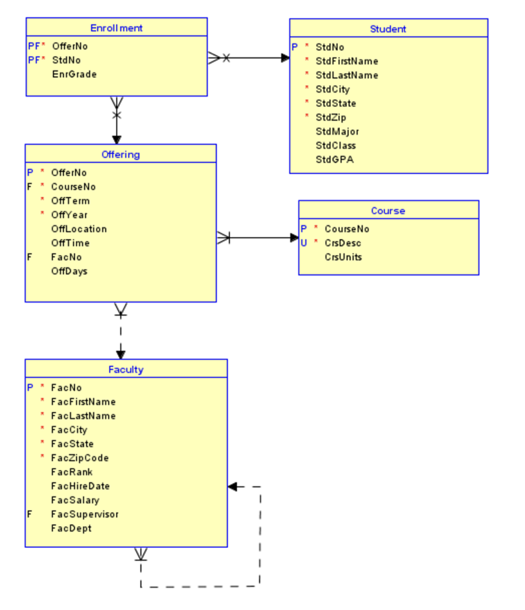

#  databases sql programming

###  contents

1.  [mysql](#mysql)
2.  [create a table](#create-a-table)
3.  [insert](#insert)
4.  [update and delete](#update-and-delete)
5.  [basic queries sfw statement](basic-queries-sfw-statement)
6.  [like operator](#like-operator)
7.  [ordering the output](#ordering-the-output)
8.  [removing duplicates](#removing-duplicates)
9.  [referencing attributes](#referencing-attributes)
10. [as operator](#as-operator)
11. [union](#union)
12. [eecs mysql server](#eecs-mysql-server)
13. [lab-08](#lab-08)
14. [objective](#objective)
15. [due date](#due-date)
16. [deliverable](#deliverable)

##  mysql

-  mysql is a database languge that allows you to create and populate tables that you can then query in strategic ways
-  basic hieracy of a database
    -  database
    -  table
-  note that queries end in a semicolon `;`


##  create a table

-  basic data types
    -  numeric `INTEGER`, `INT`, `REAL`, `FLOAT`
    -  character string of a fixed length `CHAR(n)`
    -  varing length `VARCHAR(n)`
    -  boolean `BOOLEAN`
    -  date `DATE`

```sql
CREATE TABLE PROJECT
    ( Pname     VARCHAR(15)     NOT NULL,
      Pnumber   INT             NOT NULL,
      Plocation VARCHAR(15)     NOT NULL,
      Dnum      INT             NOT NULL,
      PRIMARY KEY (Pnumber),
      UNIQUE (Pname),
      FOREIGN KEY (Dnum) REFERENCES DEPARTMENT(Dnumber)
    );
```
##  insert

-  `INSERT` inserts a tuple (row) in a relation (table)
-  attribute values should be listed in the same order as were specified in th e`CREATE TABLE` command
-  for example

```sql
INSERT INTO     EMPLOYEE
VALUES          ('Richard', 'K', 'Marini', '653298653', '1962-12-30',
                 '98 Oak Forest, Kathy, TX', 'M', 37000, '653298653', 4);
```

##  update and delete

**update**  used to modify attribute values of one or more selected tuples

```sql
UPDATE  PROJECT
SET     PLOCATION = 'Bellaire', DNUM = 5
WHERE   PNUMBER = 10
```

**delete** removes tuples from a relation

```sql
DELETE FROM     EMPLOYEE
WHERE           Lname = 'Brown';
```

##  basic queries - sfw statement

-  `SELECT <list of column expressions>`
-  `FROM <list of tables and join operations>`
-  `WHERE <row conditions connected by logical operators>`
-  `ORDER BY <list of sorting specifications>`
-  example - name of students under 25
    -  `SELECT name FROM Student WHERE age < 25`

##  `LIKE` operator

-  `LIKE` operator with meta characters
-  `%` wildcard matches 0 or more characters
-  `_` matches any single character
-  example - embedded match
    -  `CrsDesc LIKE '%DATA%'`

##  ordering the output

-  records are not ordered by default
-  note that `ASC` = ascending, `DESC` = descending
-  basic syntax
```
SELECTED
FROM
WHERE
ORDER BY output_column [ASCI DESC], ...;
```

##  removing duplicates

-  to remove duplicates from the query answers use, `SELECT DISTINCT`
-  example
-  `SELECT DISTINCT age FROM Student`

##  referencing attributes

-  in general, attributes are references as R.A. where R is a tuple variable and A is an attributes
-  where there is no ambiguity, the tuple variable may be deleted

```sql
SELECT S.lastname F.lastname gpa
FROM Students S, Faculty F
WHERE S.lastname = 'Idena';
```

##  AS operator 

-  change comumn name / headers
    -  `SELECT sid AS ID FROM Student`
-  `AS` is optional

##  union

-  strong requirement
    -  same number of columns
    -  each corresponding column is compatible
    -  positional correspondence
-  apply to similar tables by removing columns first
-  `<subquery> UNION <subquery>`

##  eecs mysql server

-  as an eecs student, you are granted access to an eecs mysql server
-  you can view your username and password under the assignments section in the sql programming credentials
-  to access the server, input the following

`mysql -h mysql.eecs.ku.edu -u username -p`

#  lab 08

-  use the university database provided for this lab
-  `ER` diagram
-  the structure of the database is as follows



##  objective

learn the basics of building and querying a database

##  due date

sunday, april 16, 2023

##  deliverable

-  form each query and generate its output and place on the page
-  do the same for all queries
-  combine all queries into a pdf
-  submit the file to canvas
-  read and understand the grading rubric
-  the sql queries and their output (one per page); submit the pdf.

##  access the data base 

access to the eecs database, go into the pwd of the `University-DB` directory

```
m358b583@cycle3:~$ mysql -h mysql.eecs.ku.edu -u m358b583 -p
Enter password: Ahr3oamu
Welcome to the MariaDB monitor.  Commands end with ; or \g.
Your MariaDB connection id is 406611
Server version: 10.6.12-MariaDB-0ubuntu0.22.04.1 Ubuntu 22.04

Copyright (c) 2000, 2018, Oracle, MariaDB Corporation Ab and others.

Type 'help;' or '\h' for help. Type '\c' to clear the current input statement.

MariaDB [(none)]> use m358b583
Database changed
```

##  import the tables

```
MariaDB [m358b583]> source  CRInsEnrollment.SQL
MariaDB [m358b583]> source  CRInsFaculty.SQL
MariaDB [m358b583]> source  CRInsStudent.SQL
MariaDB [m358b583]> source  CRInsCourse.SQL
MariaDB [m358b583]> source  CRInsOffering.SQL
MariaDB [m358b583]> show tables;
+--------------------+
| Tables_in_m358b583 |
+--------------------+
| Enrollment         |
| Faculty            |
| Offering           |
| Student            |
| course             |
+--------------------+
5 rows in set (0.001 sec)

MariaDB [m358b583]> select * from Student;
+-------------+--------------+-------------+---------+----------+------------+----------+----------+--------+
| StdNo       | StdFirstName | StdLastName | StdCity | StdState | StdZip     | StdMajor | StdClass | StdGPA |
+-------------+--------------+-------------+---------+----------+------------+----------+----------+--------+
| 123-45-6789 | HOMER        | WELLS       | SEATTLE | WA       | 98121-1111 | IS       | FR       |   3.00 |
| 124-56-7890 | BOB          | NORBERT     | BOTHELL | WA       | 98011-2121 | FIN      | JR       |   2.70 |
| 234-56-7890 | CANDY        | KENDALL     | TACOMA  | WA       | 99042-3321 | ACCT     | JR       |   3.50 |
| 345-67-8901 | WALLY        | KENDALL     | SEATTLE | WA       | 98123-1141 | IS       | SR       |   2.80 |
| 456-78-9012 | JOE          | ESTRADA     | SEATTLE | WA       | 98121-2333 | FIN      | SR       |   3.20 |
| 567-89-0123 | MARIAH       | DODGE       | SEATTLE | WA       | 98114-0021 | IS       | JR       |   3.60 |
| 678-90-1234 | TESS         | DODGE       | REDMOND | WA       | 98116-2344 | ACCT     | SO       |   3.30 |
| 789-01-2345 | ROBERTO      | MORALES     | SEATTLE | WA       | 98121-2212 | FIN      | JR       |   2.50 |
| 876-54-3210 | CRISTOPHER   | COLAN       | SEATTLE | WA       | 98114-1332 | IS       | SR       |   4.00 |
| 890-12-3456 | LUKE         | BRAZZI      | SEATTLE | WA       | 98116-0021 | IS       | SR       |   2.20 |
| 901-23-4567 | WILLIAM      | PILGRIM     | BOTHELL | WA       | 98113-1885 | IS       | SO       |   3.80 |
+-------------+--------------+-------------+---------+----------+------------+----------+----------+--------+
11 rows in set (0.001 sec)

MariaDB [m358b583]> select * from course;
+----------+--------------------------------------+----------+
| CourseNo | CrsDesc                              | CrsUnits |
+----------+--------------------------------------+----------+
| FIN300   | FUNDAMENTALS OF FINANCE              |        4 |
| FIN450   | PRINCIPLES OF INVESTMENTS            |        4 |
| FIN480   | CORPORATE FINANCE                    |        4 |
| IS320    | FUNDAMENTALS OF BUSINESS PROGRAMMING |        4 |
| IS460    | SYSTEMS ANALYSIS                     |        4 |
| IS470    | BUSINESS DATA COMMUNICATIONS         |        4 |
| IS480    | FUNDAMENTALS OF DATABASE MANAGEMENT  |        4 |
+----------+--------------------------------------+----------+
7 rows in set (0.001 sec)

MariaDB [m358b583]> select * from Enrollment;
+---------+-------------+----------+
| OfferNo | StdNo       | EnrGrade |
+---------+-------------+----------+
|    1111 | 901-23-4567 |     0.00 |
|    1234 | 123-45-6789 |     3.30 |
|    1234 | 234-56-7890 |     3.50 |
|    1234 | 345-67-8901 |     3.20 |
|    1234 | 456-78-9012 |     3.10 |
|    1234 | 567-89-0123 |     3.80 |
|    1234 | 678-90-1234 |     3.40 |
|    4321 | 123-45-6789 |     3.50 |
|    4321 | 124-56-7890 |     3.20 |
|    4321 | 789-01-2345 |     3.50 |
|    4321 | 876-54-3210 |     3.10 |
|    4321 | 890-12-3456 |     3.40 |
|    4321 | 901-23-4567 |     3.10 |
|    5555 | 123-45-6789 |     3.20 |
|    5555 | 124-56-7890 |     2.70 |
|    5678 | 123-45-6789 |     3.20 |
|    5678 | 234-56-7890 |     2.80 |
|    5678 | 345-67-8901 |     3.30 |
|    5678 | 456-78-9012 |     3.40 |
|    5678 | 567-89-0123 |     2.60 |
|    5679 | 123-45-6789 |     2.00 |
|    5679 | 124-56-7890 |     3.70 |
|    5679 | 678-90-1234 |     3.30 |
|    5679 | 789-01-2345 |     3.80 |
|    5679 | 890-12-3456 |     2.90 |
|    5679 | 901-23-4567 |     3.10 |
|    6666 | 234-56-7890 |     3.10 |
|    6666 | 567-89-0123 |     3.60 |
|    7777 | 876-54-3210 |     3.40 |
|    7777 | 890-12-3456 |     3.70 |
|    7777 | 901-23-4567 |     3.40 |
|    9876 | 124-56-7890 |     3.50 |
|    9876 | 234-56-7890 |     3.20 |
|    9876 | 345-67-8901 |     3.20 |
|    9876 | 456-78-9012 |     3.40 |
|    9876 | 567-89-0123 |     2.60 |
|    9876 | 678-90-1234 |     3.30 |
|    9876 | 901-23-4567 |     4.00 |
+---------+-------------+----------+
38 rows in set (0.001 sec)
```

##  queries

1.  retrieve students with gpa higher than 3.7, display the student first name, last name, city and gpa

```sql
SELECT StdFirstName, StdLastName, StdCity, StdGPA
FROM Student
WHERE StdGPA > 3.7;
```

2.  display student first name, last name, and gpa of students in descending order of gpa
3.  retrieve all the information about senior-level IS courses
4.  list offerings without an instructor in summer.  display the offering and course number
5.  display offering number, course number, faculty first and last name for courses offered in the spring, faculty rank as assistant `ASST` and faculty number the same as offering faculty number
6.  display distinct faculty numbver, course number, faculty first and last name for courses offered in the spring, faculty rank as assistant `ASST` and faculty number the same as offering faculty number
6.  display distinct faculty number in offering table
7.  display first names of students that live in bothell and faculty that live in bellevue.  use `UNION`
8.  insert finance freshman "John Doe" from Lawrence, Kansas, 66045 with student no `999-99-9999` and GPA 
9.  student homer wells has changed his major accounting `ACCT`.  update the student table to reflect this change.  show the result using `Select * From Student`
10.  list the students that are also on the faculty.  display all the information of such student.

```
MariaDB [m358b583]> SELECT StdFirstName, StdLastName, StdCity, StdGPA
    -> FROM Student
    -> WHERE StdGPA > 3.7;
+--------------+-------------+---------+--------+
| StdFirstName | StdLastName | StdCity | StdGPA |
+--------------+-------------+---------+--------+
| CRISTOPHER   | COLAN       | SEATTLE |   4.00 |
| WILLIAM      | PILGRIM     | BOTHELL |   3.80 |
+--------------+-------------+---------+--------+
2 rows in set (0.001 sec)

MariaDB [m358b583]> SELECT StdFirstName, StdLastName, StdGPA
    -> FROM Student
    -> ORDER BY StdGPA DESC;
+--------------+-------------+--------+
| StdFirstName | StdLastName | StdGPA |
+--------------+-------------+--------+
| CRISTOPHER   | COLAN       |   4.00 |
| WILLIAM      | PILGRIM     |   3.80 |
| MARIAH       | DODGE       |   3.60 |
| CANDY        | KENDALL     |   3.50 |
| TESS         | DODGE       |   3.30 |
| JOE          | ESTRADA     |   3.20 |
| HOMER        | WELLS       |   3.00 |
| WALLY        | KENDALL     |   2.80 |
| BOB          | NORBERT     |   2.70 |
| ROBERTO      | MORALES     |   2.50 |
| LUKE         | BRAZZI      |   2.20 |
+--------------+-------------+--------+
11 rows in set (0.001 sec)
```
